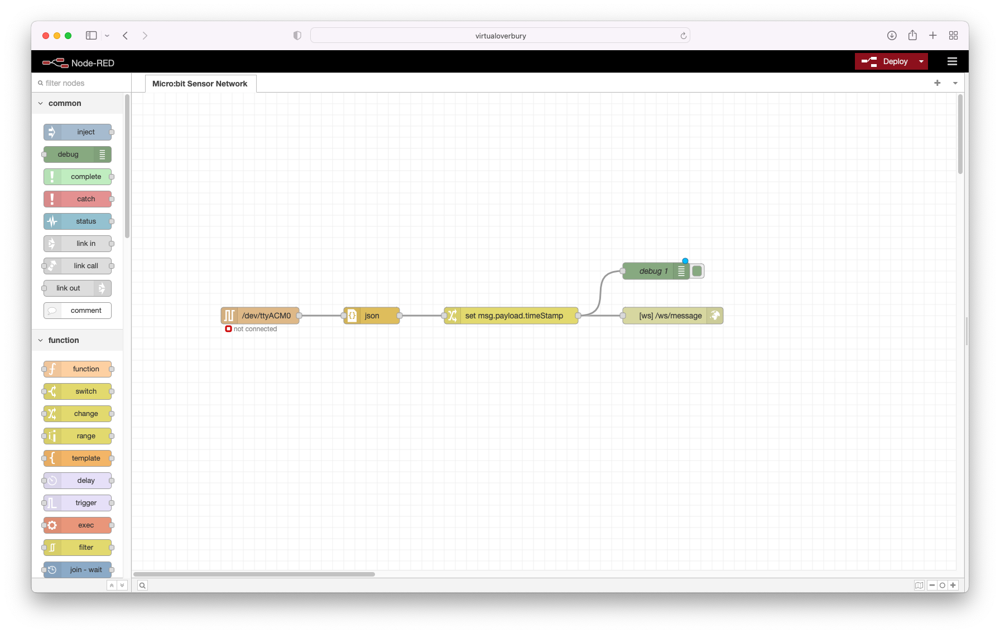
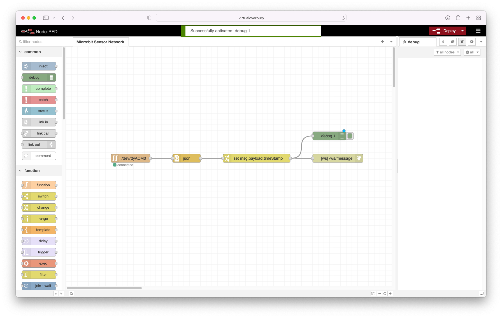
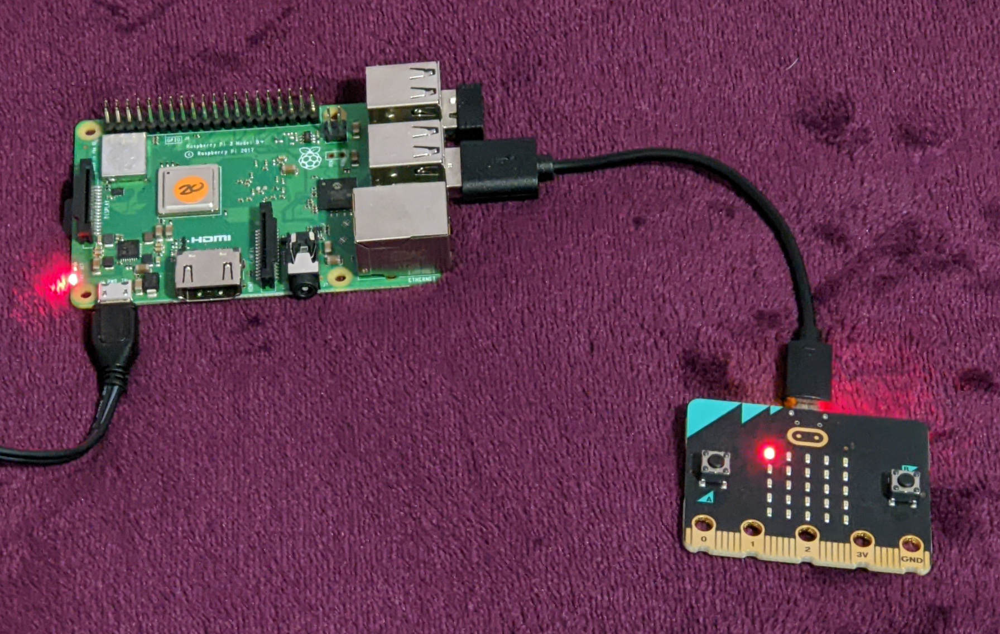

# Micro:bit Sensor Network (v1.0)

**Contents**

- [Micro:bit Sensor Network (v1.0)](#microbit-sensor-network-v10 "Micro:bit Sensor Network (v1.0)")
	- [Why](#why "Why")
	- [The Future](#the-future "The Future")
- [The Setup](#the-setup "The Setup")
	- [Hardware Design](#hardware-design "Hardware Design")
	- [Software Stack](#software-stack "Software Stack")
		- [The Sensor Micro:bits](#the-sensor-microbits "The Sensor Micro:bits")
			- [Acceleration](#acceleration "Acceleration")
			- [Light Level](#light-level "Light Level")
			- [Temperature](#temperature "Temperature")
		- [The Gateway Micro:bit](#the-gateway-microbit "The Gateway Micro:bit")
		- [Node-RED](#node-red "Node-RED")
			- [Issues](#issues "Issues")
				- [The *Gateway* Micro:bit is Showing as \"not connected\"](#the-gateway-microbit-is-showing-as-not-connected "The *Gateway* Micro:bit is Showing as \"not connected\"")
				- [No Information is Being Shown in the Browser](#no-information-is-being-shown-in-the-browser "No Information is Being Shown in the Browser")
		- [Browser Based Front-end](#browser-based-front-end "Browser Based Front-end")
	- [Everything Working](#everything-working "Everything Working")

Welcome to the Micro:bit Sensor Network (MbSN), a way to let children play and explore the idea of using Micro:bits as remote devices to capture and share their inputs in real time. These inputs are displayed numerically and as charts wirelessly and in real time using a Raspberry Pi and a browser. 

## Why?
With physical computing being able to play with an individual device and see what you can make it do is a fantastic experience but that it, an individual device. In reality the world is made up of devices that are constantly talking to each other and the MbSN allows children to code a device that is part of something bigger. For children this can be a real eye opener to a whole new world of possibilities and that's why I have done this. Showing what is possible will only start a whole new line of "what if" and "could I" discussions.

I could have used some off the shelf solutions but they all come at a cost in comparison to the Micro:bit. Also this way children will get more hands-on experiences constructing a sensor and then coding the sending of information. 

## The Future
This project isn't anywhere near complete, I just wanted to start by sharing the basics of what's possible. Let's call this version 1.0. I've got ideas on how to improve sending multiple inputs from each device and the associated charting and ideas about how to log and present the information but I want to make sure I have the basics correct first.

# The Setup

## Hardware Design

I wanted to keep the hardware as simple and understandable as possible. With this setup it's possible to physically talk through how everything is connected together. How multiple *sensor* Micro:bits can talk to a *gateway* Micro:bit which in turn talks to a Raspberry Pi. This in turn then displays all the information received.

## Software Stack

Again hopefully a simple approach to the software used, well right up until the final browser step. The *sensor* Micro:bits just contain simple blocks to set up the bluetooth connection and then send information on a regular basis. The *gateway* Micro:bit is only concerned with taking all information received over the bluetooth connection and forward it over the serial connection to the Raspberry Pi. On the Raspberry Pi Node-RED takes the incoming serial connection and after a small bit of processing, forwards the information received to a WebSocket connection. It is this that the browser connects to and receives all information through using JavaScript. Along with two additional JavaScript frameworks, Bootstrap and Chart.js, the information is displayed and charted in the browser. Each of these steps will be gone through in further detail below.

### The *Sensor* Micro:bits
This GitHub repository contains three example sensors. Each of them uses the Micro:bits own internal inputs and then sends the information at different frequencies. The information is sent as a name and value. This method limits the length of the names being sent to a maximum of 8 characters and the associated value can only be numeric. The examples use Radio Group 123 but if you do change this remember to change the Radio Group used by the *gateway* Micro:bit to match. The inclusion of the toggle block is only there to provide a visual indicator that information is being sent. After seeing the three example sensor .hex files it should be easy to create your own sensors using more complex scenarios and / or external sensors.

#### 1. Acceleration

After initialising the Radio Group to 123, the acceleration strength value, a combination of the X, Y & Z values, is sent 10 times a second (every 100ms). Download the [MbSN-Acceleration.hex](Microbit/MbSN-Acceleration.hex "MbSN-Acceleration.hex") .hex file ready to be loaded onto a Micro:bit.

#### 2. Light Level

After initialising the Radio Group to 123, the light level value is sent once every second. Download the [MbSN-LightLevel.hex](Microbit/MbSN-LightLevel.hex "MbSN-LightLevel.hex") .hex file ready to be loaded onto a Micro:bit.

#### 3. Temperature

After initialising the Radio Group to 123, the temperature value is sent once every five seconds. Download the [MbSN-Temperature.hex](Microbit/MbSN-Temperature.hex "MbSN-Temperature.hex") .hex file ready to be loaded onto a Micro:bit.

### The *Gateway* Micro:bit
This Micro:bit has only a single task to perform, receive all incoming information from one or many Micro:bits and forward it onto Node-RED on the Raspberry Pi. If you have decided to change the Radio Group used on the *sensor* Micro:bits then remember to change the Radio Group here to match. Again the inclusion of the toggle block is only there to provide a visual indicator that information is being forwarded. As long as information is sent in the same format from the *sensor* Micro:bits then this will not need to be changed.
 

After redirecting the serial connection to be over USB, setting the serial baud rate (the speed at which the information is sent) and initialising the Radio Group to 123, every time information is received it is reformatted to a simple JSON string that Node-RED on the Raspberry Pi can easily read. Download the [MbSN-Gateway.hex](Microbit/MbSN-Gateway.hex "MbSN-Gateway.hex") .hex file ready to be loaded onto a Micro:bit.

### Node-RED
Whether Node-RED is or isn't already installed on your Raspberry Pi doesn't matter as the script they provided can perform both installs and updates. Even if you believe you have Node-RED setup on your Raspberry Pi it could still be worth checking as recently they have released version 3. If you have any issues installing or updating you can find further help at Node-REDs [Running on Raspberry Pi](https://nodered.org/docs/getting-started/raspberrypi "Running on Raspberry Pi") guide.

As the Node-RED interface is viewed in a browser the following command can either be run through an SSH connection to your Raspberry Pi or through a terminal window from the desktop.

	bash <(curl -sL https://raw.githubusercontent.com/node-red/linux-installers/master/deb/update-nodejs-and-nodered)
	
Once the script has run successfully you will have the latest version of Node-RED installed and as part of the process the following commands have been installed to help manage running Node-RED.

- `node-red-start` - this starts the Node-RED service and displays its log output. Pressing Ctrl-C or closing the window does not stop the service; it keeps running in the background
- `node-red-stop` - this stops the Node-RED service
- `node-red-restart` - this stops and restarts the Node-RED service
- `node-red-log` - this displays the log output of the service

It's quite often useful to have Node-RED automatically start when your Raspberry Pi is turned on or is re-booted. To make this happen run the following command:

	sudo systemctl enable nodered.service
	
To stop this from happening run the following command:

	sudo systemctl disable nodered.service

**BEFORE PERFORMING THE FOLLOWING STEPS MAKE SURE YOU HAVE CONNECTED YOUR *GATEWAY* MICRO:BIT TO THE RASPBERRY PI**

Once you have everything running then open a browser and visit either http://localhost:1880 if you are using your Raspberry Pi or http://\<The Name of your Raspberry Pi\>:1880 if you are using another machine on the same network. If everything has worked correctly you should be presented with the page below.

From here click the hamburger menu (the three horizontal lines) in the top right to open the drop down menu and then choose to import.

From the import dialog choose to select a file to import and select this file, [MbSN-Gateway.json](Node-RED/MbSN-Gateway.json "MbSN-Gateway.json"), once you have downloaded it to your machine.

Once the import dialog is showing the contents of the file choose to import the file.

Once imported the following flow should be shown in the browser. Starting with the left most node, this receives information from the *gateway* Micro:bit over the serial connection. This in turn passes the information to a node that converts string received into an object that's contents can be easily accessed. Moving again to the right this node adds a time stamp to the information object as Micro:bits don't have internal clocks so that it can be seen when each piece of information was received. The final node directly to its right takes the information object and sends it over a WebSocket to processes connected to it. In this case the process connected to it will be a browser page.

This flow is also not ready to be used as once any changes have been made in the browser they have to be deployed to make them available. From here click the top right red Deploy button. You should see a momentary message appear at the top centre letting you know the deployment was successful. It is ready to pass messages on from the *gateway* Micro:bit to be displayed numerically and as charts.

#### Issues

##### The *Gateway* Micro:bit is Showing as "not connected"

This is usually caused by the Raspberry Pi loading the Micro:bit's serial port as a different device address to the one defined in the Node-RED flow imported. If this has happened it's just a process of finding what the correct device address is. First open up an SSH connection to your Raspberry Pi or a terminal window from the desktop and enter the following commands.

	cd /dev/serial/by-id
	ls -al | grep micro:bit

This should return a line similar to the output below and the important bit is the final text after the -> or in this case ../../ttyACM0.

`lrwxrwxrwx 1 root root 13 Jul 25 22:47 usb-ARM\_\_BBC\_micro:bit\_CMSIS-DAP\_\_9904360254174e45000b000400000050000000009796990b-if01 -> ../../ttyACM0`

As the first command we issued above was to change directory (cd) to /dev/serial/by-id the two sets of .. in the final text each tell us to go back up a directory leaving us with /dev to which we add /ttyACM0. This gives us a device address of /dev/ttyACM0.

Next we double click the first node in the flow which receives messages from the *Gateway" Micro:bit to bring up its properties.

In the properties panel that has appeared on the right click the pencil edit icon to the right of the Serial Port dropdown menu to edit this serial connection.

 
Now updated the Serial Port to be the /dev/... that you identified above. Go back to the flow view by clicking the red Updated and then Done buttons. Finally remember to deploy your changes by clicking the red Deploy button. Hopefully by this point your serial node should be showing connected.

##### No Information is Being Shown in the Browser

If this is happening then there is a debug node directly above the final node in the flow that will display all the information being received into a debug window. First thing to check is that the visual indicators on both the *Sensor* and *Gateway* Micro:bits are toggling. If the *Sensor* isn't showing, check the frequency of the information being sent, is it too long? If the *Gateway* isn't showing, check the Radio Groups group being used, are the *Sensor* and *Gateway* using the same? If both are toggling then we can see what messages are being received.

First hover your mouse over the middle right hand edge of the flow window in the browser and a tab should pop out, click this tab.

Now with the right hand panel visible click the little insect / bug icon in the top of it so that it shows debug information.

Next on the right hand end of the green debug node there appears to be a little grey button half sticking out from behind it. Click this button.

Once clicked the button will pop out and change from grey to the same green as the rest of the debug button.

From here any information that is being sent to the WebSocket node is also sent to the Debug node. Hopefully this will give you an insight to what information is / isn't being sent.

### Browser Based Front-end
This web page does not need to be served from a web server. Download the [Microbit-Sensor-Network.html](Web/Microbit-Sensor-Network.html "Microbit-Sensor-Network.html") .html file and double click it in your file explorer to view it in your browser. If you are viewing this page on your Raspberry Pi then there is nothing to change, but if you are using another machine on the same network then you'll need to change the following line at the top of the .html file from "localhost" to the name of your Raspberry Pi

	const wsServerURL = "ws://localhost:1880/";

With no *Sensor* Micro:bits sending information the page should look like the following.

Once a *Sensor* Micro:bit is sending information then the page will automatically update to show an information bar for that type of sensor information. The following image shows the page receiving information from all three types of *Sensor* Micro:bits.

Each of the sensor types are expandable by clicking on them. Once expanded they will show a scrolling chart of information. Each type is configurable to show different amounts of charted information. In these examples the Acceleration is showing the last 100 pieces of information because of the frequency that this information is received.

The Light Level shows the last 50 pieces of information due to it sending information at a slower frequency than Acceleration.

The Temperature shows even less pieces of information at 30 due to it sending information even slower than the Light Level sensor.

Each chart can be collapsed by clicking it to return back to the information bar view. 

If you wish to add your own sensor types then at the bottom of the .html file there is a config function that provides all the required settings. Currently it has the configurations for Acceleration, Light Level and Temperature and looks like this

	function configLookup(name) {
		/*
		The section below is configurable for each message name.

		Message names can only be a maximum of 8 characters (a Micro:bit limitation).
		The names displayed are the associated full names.
		Colours are in RGB hexadecimal format.
		If the min / max values are left undefined then the charts will automatically size themselves.
		The max buffer size is the number of values displayed on the chart before being scrolled.
		Any values not overridden will just fall back to the default values at the top.
		*/

		var config = {
			fullName: "Unknown (" + name + ")",
			lineColour: "#000000",
			minValue: undefined,
			maxValue: undefined,
			valueUnit: "",
			maxBufferSize: 30
		}

		switch(name.toLowerCase()) {
			case "accelera":
				config.fullName = "Acceleration";
				config.lineColour = "#FF0000";
				config.minValue = 0;
				config.maxValue = 3500;
				config.valueUnit = "mg";
				config.maxBufferSize = 100;
				break;
			case "lightlev":
				config.fullName = "Light Level";
				config.lineColour = "#00FF00";
				config.minValue = 0;
				config.maxValue = 255;
				config.maxBufferSize = 50;
				break;
			case "temperat":
				config.fullName = "Temperature";
				config.lineColour = "#0000FF";
				config.minValue = -5;
				config.maxValue = 50;
				config.valueUnit = "°C";
				break;
		}
		    
		return config;
	}
	
For example to add a Compass sensor we would add our own section below the Temperature section and override the default configuration values.

			case "compass":
				config.fullName = "Compass Heading";
				config.minValue = 0;
				config.maxValue = 359;
				config.valueUnit = "°";
				break;

The name of the sensor is always entered here in lower case and we provide overrides for its full name, minimum value, maximum value and value unit. We are accepting the default values for line colour and maximum buffer size. To finish a section you always include the `break;` command to indicate the end of the section.

## Everything Working?

If you've read this far then firstly well done, but have you read this far before starting anything or after you've realised somethings not working? If everything is working then my sensor hardware looked like this

And my gateway and Raspberry Pi hardware looked like this

As I said at the top, this project is nowhere near finished! I've got ideas to extend functionality and allow children to get more hands-on experience of physical computing, using sensors and sending information wirelessly and in real time. So watch this space (and twitter).

Robert Bilsland  

[@BobBilsland](https://twitter.com/bobbilsland "@BobBilsland")
