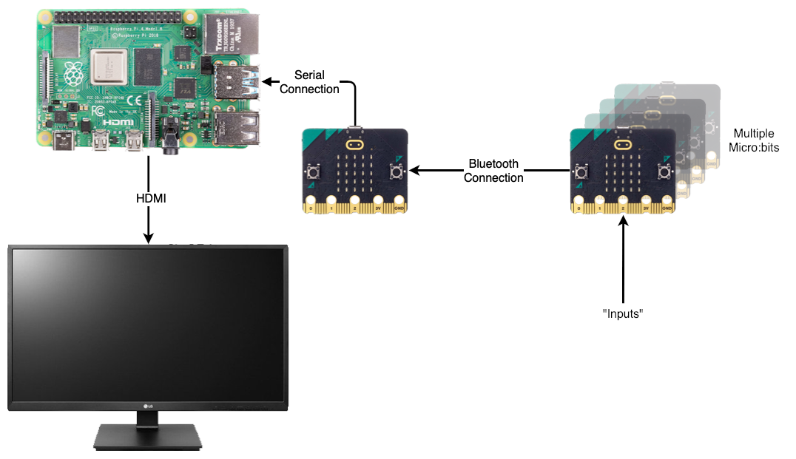

# Micro:bit Sensor Network (v1.0)
Welcome to the Micro:bit Sensor Network (MbSN), a way to let chrilden play and explore the idea of using Micro:bits as remote devices to capture and share their inputs in realtime. These inputs are then able to be displayed numerically and as charts wirelessly and in realtime using a Raspberry Pi. 

## Why?
With physical computing being able to play with an individual device and see what you can make it do is a fantastic experience but this experience is taken to a whole new level when you start to get multiple devices talking to each other. For children this can be a real eye opener to a whole new world of possibilities and that's my why. Showing what is possible will only start a whole new line of what if and could I discussions.

I could have used some off the shelf solutions but they all come at a cost in comparison to a Micro:bit. Also this way the child would get more hands on experiences constructing a sensor and then coding the sending of information over bluetooth. 

## The Future
This project isn't anywhere near finished, I just wanted to start by share the basics of what's possible. Let's call this version 1. I've got ideas on how to improve sending multiple inputs from each device and the associated charting but I've also got other ideas about how to log and present the information but I want to make sure I have this basics correct first.

# The Setup

## Hardware Design

I wanted to keep the hardware as simple and understandable as possible. With this setup it's possible to physically talk through how everything is connected together. How multiple "sensor" Micro:bits talk to a "gateway" Micro:bit which in turn talks to a Raspberry Pi. This in turn displays all the information received.

## Software Stack

Again hopefully a simple approach to the software used, well right up until the final browser step. The "sensor" Micro:bits just contain simple blocks to setup the bluetooth connection and then send information on a regular basis. The "gateway" Micro:bit is only concerned with taking all information received over the bluetooth connection and forward it over the serial connection to the Raspberry Pi. On the Raspberry Pi Node-RED takes the incoming serial connection and forwards all the information received to a WebSocket connection. It is this that the browser connects to and receives all information through using JavaScript. Along with two addition JavaScript frameworks, Bootstrap and Chart.js, the information is displayed and charted in the browser. Each of these steps will be gone through in further detail below.

### The "Sensor" Micro:bits
This GitHub repository contains three example sensors. Each of them use the Micro:bits own internal inputs and send their information at different frequency. The information is sent as a name and value. This method limits the length of the names being sent to a maximum of 8 characters and the associated value can only be numeric. The examples use Radio Group 123 but if you do change this remember to change the Radio Group used by the "gateway" Micro:bit as well. The inclusion of the toggle block is only there to provide a visual indicator that information is being sent. After seeing the three example sensor .hex files it should be easy to create your own sensors using more complex scenarios and / or external sensors.

1. Acceleration

After initialising the Radio Group to 123, the acceleration strength value, a combined X, Y & Z values, is sent 10 times a second (every 100ms). Download the [MbSN-Acceleration.hex](Microbit/MbSN-Acceleration.hex "MbSN-Acceleration.hex") .hex file ready to be loaded onto a Micro:bit.

2. Light Level

After initialising the Radio Group to 123, the light level value is sent once every second. Download the [MbSN-LightLevel.hex](Microbit/MbSN-LightLevel.hex "MbSN-LightLevel.hex") .hex file ready to be loaded onto a Micro:bit.

3. Temperature

After initialising the Radio Group to 123, the temperature value is sent once every five seconds. Download the [MbSN-Temperature.hex](Microbit/MbSN-Temperature.hex "MbSN-Temperature.hex") .hex file ready to be loaded onto a Micro:bit.

### The "Gateway" Micro:bit
This Micro:bit has only a single task to perform, receive all incomming information from one or many Micro:bits and forward them onto Node-RED on the Raspberry Pi. If you have decided to change the Radio Group used on the "sensor" Micro:bits then remember to change the Radio Group here as well to match. Again the inclusion of the toggle block is only there to provide a visual indicator that information is being forwarded. As long as information carrys on being sent in the same style as the example "sensor" Micro:bits then this will not need to be changed.
 

After redirecting the serial connection to be over USB, setting the serial baud rate (the speed information can be sent) and initialising the Radio Group to 123, every time information is received it is reformatted to a simple JSON string that Node-RED on the Raspberry Pi can easily read. Download the [MbSN-Gateway.hex](Microbit/MbSN-Gateway.hex "MbSN-Gateway.hex") .hex file ready to be loaded onto a Micro:bit.

### Node-RED

Whether Node-RED is or isn't already is already installed on your Raspberry Pi doesn't matter as the script provided can perform both installs and updates. Even if you believe you have Node-RED full setup on your Raspberry Pi it could still be worth checking as recently they have released version 3. If you have any issues installing or updating you can find further help at Node-REDs [Running on Raspberry Pi](https://nodered.org/docs/getting-started/raspberrypi "Running on Raspberry Pi") guide.

As the Node-RED interface is viewed in a browser the following command can either be run through an SSH connection to the Raspberry Pi or through a terminal window from the desktop.

	bash <(curl -sL https://raw.githubusercontent.com/node-red/linux-installers/master/deb/update-nodejs-and-nodered)
	
Once the script has run successfully you will have the latest version of Node-RED installed and as part of the process the following commands have been installed to help manage the running of Node-RED.

- `node-red-start` - this starts the Node-RED service and displays its log output. Pressing Ctrl-C or closing the window does not stop the service; it keeps running in the background
- `node-red-stop` - this stops the Node-RED service
- `node-red-restart` - this stops and restarts the Node-RED service
- `node-red-log` - this displays the log output of the service

It is also useful to have Node-RED automatically start when the Raspberry Pi is turned on or is re-booted. To make this happen run the following command:

	sudo systemctl enable nodered.service
	
To stop this from happening run the following command:

	sudo systemctl disable nodered.service

**BEFORE PERFORMING THE FOLLOWING STEPS MAKE SURE YOU HAVE CONNECTED YOUR "GATEWAY" MICRO:BIT TO THE RASPBERRY PI**

Once you have everything running then open a browser and either visit http://localhost:1880 if you are using your Raspberry Pi to surf the Internet or visit http://<The Name of your Raspberry Pi>:1880 if you are using another machine on your network (making sure you replace <The Name of your Raspberry Pi> with the name of your Raspberry Pi. If everything is working correctly they you should be presented with a page looking like below.

From here click the hamburger menu (the three horizontal lines) in the top right to open the drop down menu and then choose to import.

From the import dialog choose to select a file to import and select this file, [MbSN-Gateway.json](Node-RED/MbSN-Gateway.json "MbSN-Gateway.json"), once you have downloaded it to your machine.

Once the import dialog is showing the contents of the file choose to import the file.

Once imported the following flow should be shown in the browser. Starting with the left most node the first node receives message from the "gateway" Micro:bit over the serial connection. This in turn passes the message to a node that converts the JSON string into a JSON object so it's contents can be easily accessed. Moving again to the right this node adds a time stamp to the message object as Micro:bits don't have internal clocks so that it can be seen when each message was received. Taking the final node directly to it's right this node now takes the message object and send it over a WebSocket to any processes connected to it. The green node directly above this final node is for debug purposes and will show what messages are being sent over the WebSocket. In it's current state it is disabled. This flow is also not ready to be used as once any changes have been made in the browser they have to be deployed to make them available. From here click the top right red deploy button. 

Once deployed you should see a momentary message appear at the top center of the browser window stating so. Once this has been done it is ready to pass messages on from the "gateway" Micro:bit to be displayed numerically and as charts.

